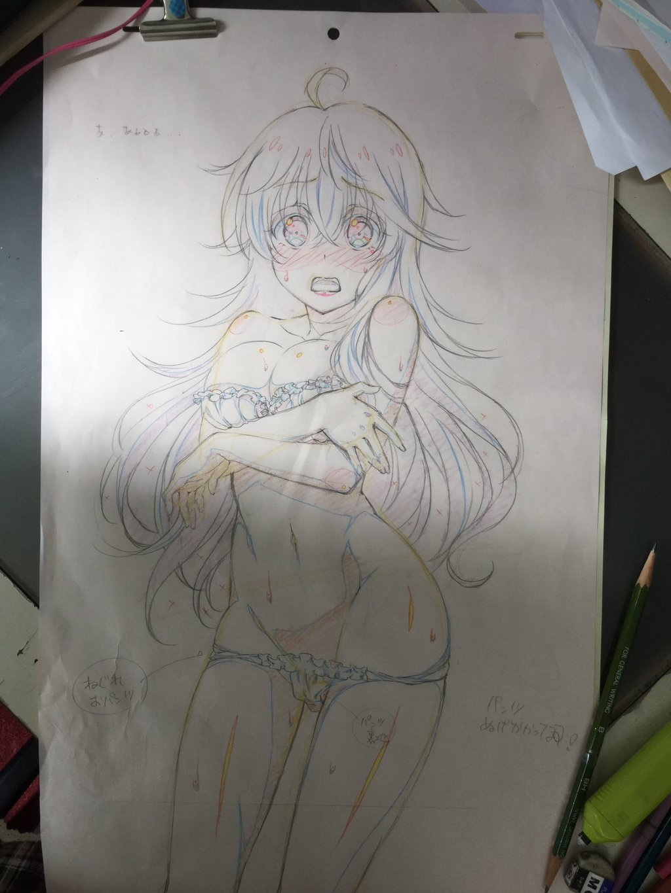

# 2016-05-07

这是日记的第一行，今天下午用了两个多小时对Git进行了入门学习。

### 今天学习的主要内容有：

Git 简介

> 诞生、集中式和分布式版本管理比较

Git 安装和创建版本库

时光机穿梭

> 版本回退
>
> 工作区和暂存区
>
> 管理和撤销修改
>
> 删除文件

远程仓库

> 本地和Github建立连接、添加远程库
>
> 从远程库克隆

  

  